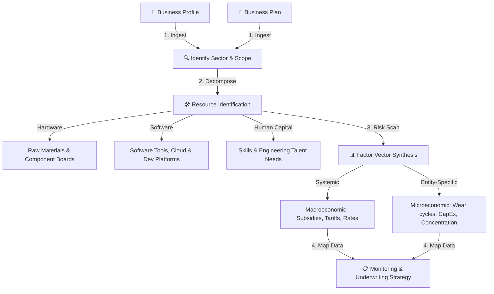

# Enterprise Credit and Risk Assessment System

This document outlines the input requirements, output specifications, core analytical process, and agentic architecture of the **Enterprise Credit and Risk Assessment System**. The platform is designed to assist financial institutions in making initial loan/funding sanction decisions and continuously monitoring enterprise credit health post-disbursement.

---

## 1. System Inputs & Outputs

### 1.1 Inputs
The system ingests two primary documents:

1.  **Business Profile:**
    *   **Enterprise Name:** Official legal name of the entity.
    *   **Scope of Business:** Primary domain of operation.
    *   **Products/Services:** Detailed business offerings and technical specifications.
    *   **Regions of Operation:** Active geographic footprints (headquarters, manufacturing sites, warehouses).
    *   **Target Customer Segments:** Tier-1 aggregators, direct consumers, B2B distributors.
    *   **Target Markets:** Domestic and export regions for expansion or nearshoring.
    *   **Key Differentiators:** Structural competitive advantages.
2.  **Business Plan:**
    *   **Executive Summary:** High-level strategic overview.
    *   **Company Profile:** Mission, vision, core values, and historical milestones.
    *   **Products & Services Description:** Technical specifications, roadmap, and business/monetization models.
    *   **Marketing & Sales Strategy:** Go-to-market plan and customer acquisition strategy.
    *   **Operations Plan:** Facility requirements, logistics routes, and utility setups.
    *   **Management Team:** Profiles of founders, directors, and critical leaders.
    *   **Financial Projections:** 3-to-5 year balance sheet, cash flow, and income statements.
    *   **Funding Request:** Requested facility size, maturity, and utilization targets.
    *   **Risk Management Plan:** Identified vulnerabilities and mitigation actions.
    *   **Dependencies:** Critical hardware components, software tools, and development platforms.
    *   **Team Structure & Expertise:** Roles, reporting structures, and technical capability indices.

### 1.2 Outputs
The system computes and outputs a comprehensive risk report containing:

1.  **Executive Credit & Risk Scoreboard:**
    *   *Geopolitical & Geographic Rating*
    *   *Supply Chain & Operations Rating*
    *   *Financial & Capital Structure Rating*
    *   *Pricing Power & Margin Integrity Rating*
    *   *Systematic & Regulatory Rating*
    *   *Overall Weighted Credit Rating* (e.g., AAA to D)
2.  **Supply Chain Resilience & Lead Time Forecasts:**
    *   *Risk Profile:* Assessment of single-sourcing, transit bottlenecks, and customs delays.
    *   *Mitigation Strategies:* Dual-sourcing recommendations, inventory buffer calculations, and geographical diversification plans.
3.  **Financial Stress-Test Simulation Models:**
    *   *Base Case vs. Cumulative Macro Shock:* Simulating simultaneous stress events (monetary tightening, trade/tariff shifts, interest rate spikes, inflation, currency devaluations, and subsidy rollbacks).
    *   *Debt Servicing Capacity:* Debt Service Coverage Ratio (DSCR) and Interest Coverage Ratio (ICR) projections.
    *   *Liquidity Runway:* Projecting cash reserves and months of OpEx coverage under sustained adverse scenarios.
    *   *Covenant Breach Probability:* Likelihood of violating bank covenants (e.g., Leverage > 4.0x or ICR < 2.0x).
    *   *Capital Buffer Adequacy:* Quantitative estimate of additional equity or capital buffer needed to survive the shock.
    *   *Early Warning Indicators:* Actionable triggers (Amber and Red alert thresholds) for financial intervention.
4.  **Scenario-Based Vendor Pricing Impact Analysis:**
    *   *Pricing Power & Margin Integrity:* Simulating gross margin shifts under input cost hikes.
    *   *Systematic & Regulatory Analysis:* Evaluating subsidy rollbacks or energy grid tariff hikes.
    *   *Overall Rating Sensitivity:* The impact of supply chain delays and commodity shocks on the overall credit score.

---

## 2. Core Processing Flow

The system processes business inputs through a four-stage analysis framework:

1.  **Sector & Scope Identification:** Programmatically map the business profile and plan to its parent industry sector and operational category.
2.  **Resource Decomposition:**
    *   *Hardware & Materials:* Identify required raw materials (if manufacturing-focused) and hardware boards/components.
    *   *Software & Platforms:* Identify cloud infrastructure, specialized developer tools, and operational software dependencies.
    *   *Human Capital:* Map required skills and engineering talent against the management team's current expertise index.
3.  **Factor Vector Synthesis:**
    *   *Systemic Macro Factors:* Map out global tariffs, domestic PLI incentives, utility grids, and interest rate indices.
    *   *Entity-Specific Micro Risks:* Identify supplier concentration, pricing power limitations, CapEx requirements, and technology obsolescence rates.
4.  **Data Strategy Mapping:**
    *   Identify tracking parameters for each risk factor.
    *   Suggest structured (APIs, exchange data) and unstructured (regulatory bulletins, news sentiment) data sources.
    *   Incorporate collected workspace data, or define formats for offline data ingestion.

---

## 3. Operations Lifecycle (Underwriting & Monitoring)

*   **Pre-Disbursal Decision Support:** The system provides institutional underwriters with clear, risk-adjusted ratings, stress-test simulations, and capital adequacy metrics to decide whether a loan should be sanctioned.
*   **Post-Disbursal Health Monitoring:** Once a loan is disbursed, the platform continuously tracks the mapped monitoring parameters (e.g., LME prices, local tariffs, credit rating changes) to trigger early warning signals and suggest proactive risk mitigation steps.

---

## 4. Agentic Architecture

The system utilizes specialized AI agents to orchestrate the evaluation workflow:

### 4.1 Business Plan Review Agent
*   **Input:** Complete Business Plan document.
*   **Output & Evaluation Checklist:**
    *   **Auditable Items:** Identify and verify all key assumptions, target dates, and financial metrics.
    *   **Business Viability:** Review market sizing, competitive dynamics, TAM calculations, and operational feasibility.
    *   **ESG Considerations:** Evaluate carbon tax exposure, labor guidelines, and corporate governance models.
    *   **Ethical Review:** Assess core alignment with ethical business practices and social contribution.
    *   **National Security Risk:** Inspect critical infrastructure dependencies, dual-use technology exposure, and foreign ownership patterns.
    *   **Legal & Regulatory Compliance:** Verify compliance status, licenses, and IP-related aspects:
        *   *IP Ownership:* Ownership clarity of core technologies.
        *   *IP Protection:* Patents, copyrights, and trademarks filed.
        *   *IP Infringement Risks:* Potential conflict with existing competitor IP.
    *   **Exit Criteria Clarity:** Assess the feasibility and clarity of loan repayment plans or investor exits.
    *   **Timeline Review:** Critically evaluate roadmap milestones vs. typical industry implementation cycles.
    *   **Team Competence vs. Scope:** Map management team expertise against operational requirements.
    *   **Funding Recommendation:** Provide a clear "Fund / Do Not Fund" decision with structured justifications.
    *   **Gaps & Recommendations:** Document identified plan gaps and operational recommendations.

### 4.2 Credit Risk Assessment Agent
*   **Input:** Financial projections, historical sheets, and macro/micro factor indices.
*   **Output:** The Credit & Risk Scoreboard, stress-test models, DSCR/ICR projects, and loan covenant breach probabilities.