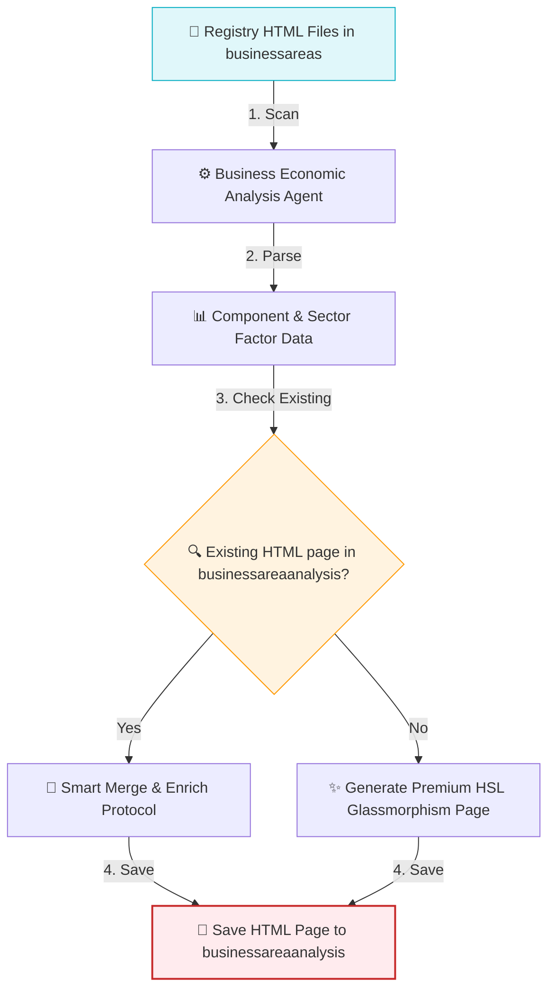

# Business Economic Analysis Agent

The `business_economic_analysis` is an AI agent built on the Google Agent Development Kit (ADK). It orchestrates the downstream analysis of B2B business areas that have been registered under the business areas directory. The agent parses registries, retrieves existing analysis pages, and generates or updates premium, high-fidelity B2B market research sector HTML reports.

All generated HTML pages feature a sleek, desaturated glassmorphic dark HSL theme with a mist-cyan accent, establishing visual and stylistic parity across all reports.

---

## 🏗️ Core Workflow



1. **Ingestion & Registry Scanning:** Scans the `reports/marketresearch/businessareas/` directory to discover HTML-based registries containing registered B2B components.
2. **Parsing:** Parses each registry HTML file to extract component names, sectors, macroeconomic factors, and microeconomic factors.
3. **Smart Merge Protocol:** Resolves a unified filename slug in the format `[component_area]___[sector].html` (lowercased, spaces/special characters replaced with underscores) and checks if the analysis page already exists:
   - **If it exists:** Proactively reads and merges the new data with existing analysis (sentences, CapEx drivers, active lenders, glossary terms) while preserving DOM structures and inline styles.
   - **If it does not exist:** Generates a complete, beautiful HSL glassmorphism page from scratch.
4. **Saving:** Records the finalized page to the target directory: `/Users/kishore/myprojects/vectranyx/reports/marketresearch/businessareaanalysis/`.

---

## 🛠️ Tool Integrations

* **`list_registry_files()`**: Lists all B2B registry HTML files inside the `businessareas` directory.
* **`parse_registry_html(filename)`**: Reads and parses B2B business area factor rows from a registry HTML file in the `businessareas` directory.
* **`read_existing_analysis(component_area, sector)`**: Reads the content of an existing B2B sector page inside `businessareaanalysis` by resolving the combined slug filename.
* **`save_html_page(html_content, component_area, sector)`**: Saves the generated/updated B2B market research HTML page.
* **`list_existing_research_pages()`**: Retrieves the list of existing market research HTML pages in the `businessareaanalysis` directory for structural or styling reference.

---

## 🚀 Usage

Navigate to the `agents` folder and invoke the agent using the ADK CLI:

```bash
cd /Users/kishore/myprojects/vectranyx/productdev_support/agents
adk run business_economic_analysis
```

### Prompt Example:

Once the agent session starts, instruct it to carry out analysis:

```text
[user]: Carry out analysis of business areas identified earlier
```

---

## 📂 Directory Layout

* [agent.py](file:///Users/kishore/myprojects/vectranyx/productdev_support/agents/business_economic_analysis/agent.py): Core ADK agent definition and tools for file I/O, parsing, and page generation.
* [.env](file:///Users/kishore/myprojects/vectranyx/productdev_support/agents/business_economic_analysis/.env): API credentials and environment configurations.
* [dotenvexample](file:///Users/kishore/myprojects/vectranyx/productdev_support/agents/business_economic_analysis/dotenvexample): Example environment configurations template.
