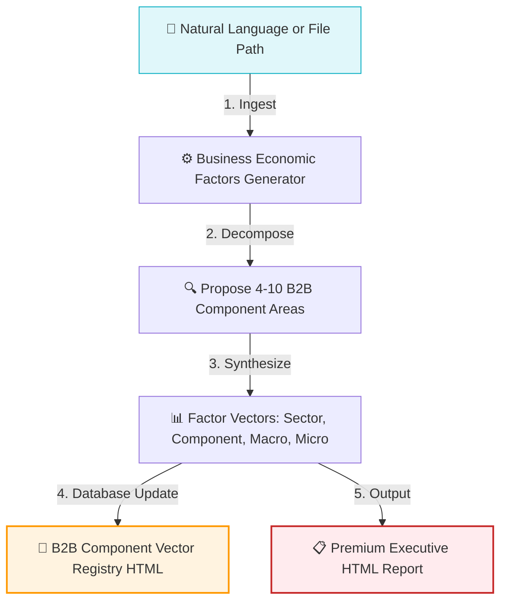

# Business Economic Factors Generator Agent

The `business_economic_factors_generator` is an AI agent built on the Google Agent Development Kit (ADK). It analyzes natural language inputs, industry trends, or structured file paths to extract granular B2B business areas, mapping them to systemic macroeconomic variables and operational microeconomic risks within the Indian economic context.

The resulting vector data is compiled into a high-fidelity B2B Component Vector Registry (`.html` files) to serve as a structured index for credit underwriting and downstream risk simulators.

---

## 🏗️ Core Workflow



1. **Ingestion:** Reads raw business descriptions or parses target input files using the `read_from_file` tool.
2. **Decomposition:** Proposes 4 to 10 granular B2B business areas or manufacturing sub-assemblies specifically tailored to the Indian operating environment.
3. **Factor Synthesis:** For each identified area, it defines:
   - **Component Area:** Highly granular target machinery or component systems (e.g. specialized EV brake calipers, cleanroom air filters).
   - **Industry Sector:** The parent B2B macro sector.
   - **Macroeconomic Factors (Systemic):** Global constraints, PLI schemes, base tariffs, exchange rate dependencies.
   - **Microeconomic Factors (Entity-Specific):** Upfront CapEx, component wear cycles, training overheads, specific supplier concentration risks.
4. **Registry Compilation:** Saves or appends these records to a styled registry file in the target directory: `/Users/kishore/myprojects/vectranyx/reports/marketresearch/businessareas/`.
5. **Executive Summary:** Renders a formatted HTML summary table confirming registration.

---

## 🛠️ Tool Integrations

* **`read_from_file(filename)`**: Allows the agent to ingest and read contents of local input files (e.g., `.md` or `.txt` profiles).
* **`register_business_area(...)`**: Automatically builds a custom HTML registry page using sleek, desaturated glassmorphic dark HSL styling, or appends new table rows safely under `<tbody id="registry-body">` if the registry already exists.

---

## 🚀 Usage

Navigate to the `agents` folder and invoke the agent using the ADK CLI:

```bash
cd /Users/kishore/myprojects/vectranyx/productdev_support/agents
adk run business_economic_factors_generator
```

### Prompt Examples:

* **Ingesting a file:**
  ```text
  [user]: /Users/kishore/myprojects/vectranyx/productdev_support/agents/business_economic_factors_generator/input/automotive_sector_input.md
  ```
* **Providing natural language directly:**
  ```text
  [user]: Analyze the green hydrogen generation and storage equipment manufacturing landscape in India.
  ```

---

## 📂 Directory Layout

* `agent.py`: Core ADK agent definition and orchestration workflow.
* `.env`: API credentials and environment configurations.
* `input/`: Sample profiles and source documents.
