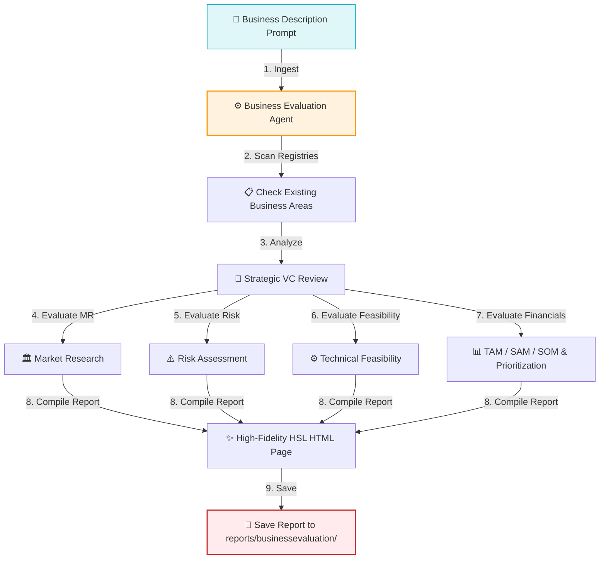

# Business Evaluation Agent

The `business_evaluation` agent is an AI agent built on the Google Agent Development Kit (ADK). It ingests a natural language description of a business, product, or solution, performs an in-depth venture-capital-style strategic analysis, and generates a premium, high-fidelity business valuation report.

The generated report is saved as an HTML file inside the `/reports/businessevaluation/` folder, utilizing a modern, desaturated dark HSL glassmorphism theme.

---

## 🏗️ Core Workflow



1. **Ingestion:** Receives the business description from the user prompt.
2. **Registry Scanning:** Calls workspace tools to identify previously registered business areas in the project environment.
3. **Analysis:** Evaluates the concept across four major pillars:
   - **Market Research:** Examines problem prevalence, market readiness, target audiences, and competing solutions.
   - **Risk Assessment:** Investigates development complexity, bottlenecks, and "the possibility of 3rd class" (copycats, platform lock-in, low-barrier competition, 3rd party dependency/obsolescence risks).
   - **Technical Feasibility:** Investigates implementation practicality, functional/non-functional challenges, market references, and build timelines for MVP vs Full Product.
   - **Financials & Sizing:** Details TAM, SAM, and SOM metrics, and ranks existing identified business areas to target for initial integration.
4. **Report Compilation:** Synthesizes the findings into a sleek, responsive HTML document.
5. **Saving:** Automatically names the output using the slug format `[business_name]_evaluation.html` and saves it to `/reports/businessevaluation/`.

---

## 🛠️ Tool Integrations

* **`list_registry_files()`**: Discover existing B2B registry files inside the `/reports/marketresearch/businessareas/` directory.
* **`parse_registry_html(filename)`**: Extract registered business area and sector details to cross-reference priority areas.
* **`save_evaluation_report(html_content, business_name)`**: Saves the generated HTML content as a standalone, styled file under `/Users/kishore/myprojects/vectranyx/reports/businessevaluation/`.

---

## 🚀 Usage

Navigate to the `agents` folder and invoke the agent using the ADK CLI:

```bash
cd /Users/kishore/myprojects/vectranyx/productdev_support/agents
adk run business_evaluation
```

### Prompt Example:

```text
[user]: Evaluate a business idea for a decentralized logistics network in India that connects independent truckers with cargo shippers through real-time spot auctioning, eliminating broker margins and optimizing fleet utilization.
```

---

## 📂 Directory Layout

* [agent.py](file:///Users/kishore/myprojects/vectranyx/productdev_support/agents/business_evaluation/agent.py): Core ADK agent definition, registry parsing, and HTML saving tools.
* [.env](file:///Users/kishore/myprojects/vectranyx/productdev_support/agents/business_evaluation/.env): API credentials and environment configurations.
* [dotenvexample](file:///Users/kishore/myprojects/vectranyx/productdev_support/agents/business_evaluation/dotenvexample): Example environment configurations template.
