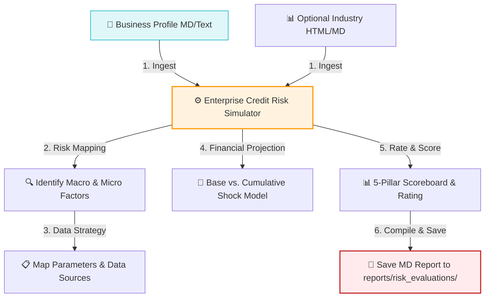

# Enterprise Credit Risk Simulator Agent

The `enterprise_credit_risk_simulator` is an AI agent built on the Google Agent Development Kit (ADK). It ingests a target company's business profile and optional sector/industry background context to identify macroeconomic and microeconomic risk factors, define key parameters and data sources to monitor, and simulate financial stress-testing models.

The resulting Credit & Risk Evaluation Report is generated in Markdown (`.md`) format and saved under the `/reports/risk_evaluations/` directory.

---

## 🏗️ Core Workflow



1. **Ingestion:** Reads target company profile details (Enterprise name, Scope of business, Product/services, Regions, Target customers/markets, Key differentiators) and optional sector background.
2. **Factor & Parameter Identification:** Specific to the profile and sector, it maps out macro/micro factors, required monitoring parameters, data to track, and primary data sources (structured/unstructured).
3. **Credit Scoreboard & Rating:** Assigns a credit grade (AAA to D) across 5 core dimensions: Geopolitical, Supply Chain, Financial, Pricing Power, and Systematic/Regulatory, providing an overall rating.
4. **Financial Stress-Test Simulation:** Compares a Base Case against a Cumulative Macro Shock (trade shifts, monetary tightening, fiscal rollback, inflation, currency pressures), projecting DSCR, ICR, liquidity runway, and covenant breach probabilities.
5. **Vendor Pricing Scenario Analysis:** Simulates margin impacts of vendor pricing spikes and supply chain delays.
6. **Saving:** Generates and saves the evaluation report under `reports/risk_evaluations/` as `[enterprise_name]_credit_risk_evaluation.md`.

---

## 🛠️ Tool Integrations

* **`read_profile_file(filepath)`**: Read local business profile files.
* **`read_industry_file(filepath)`**: Read local sector details or registry HTML files.
* **`save_credit_risk_report(markdown_content, enterprise_name)`**: Saves the generated markdown evaluation under `/Users/kishore/myprojects/vectranyx/reports/risk_evaluations/`.

---

## 🚀 Usage

Navigate to the `agents` folder and invoke the agent using the ADK CLI:

```bash
cd /Users/kishore/myprojects/vectranyx/productdev_support/agents
adk run enterprise_credit_risk_simulator
```

### Prompt Example:
```text
Evaluate the profile at /Users/kishore/myprojects/vectranyx/braking_systems_sample_profile.md with industry details from /Users/kishore/myprojects/vectranyx/braking_systems.html
```

---

## 📂 Directory Layout

* `agent.py`: Core ADK agent definition and tools.
* `requirements.txt`: Dependencies for the agent.
* `.env`: Configuration settings for Vertex AI/Gemini.
* `README.md`: Setup and execution documentation.
